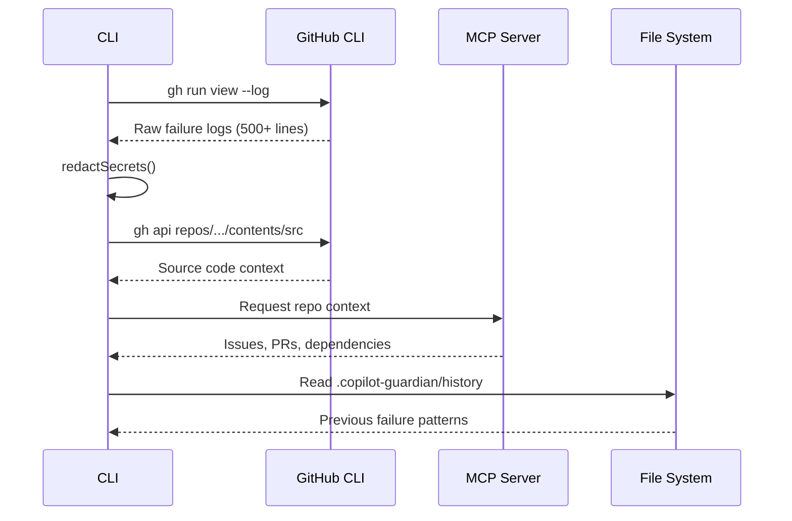
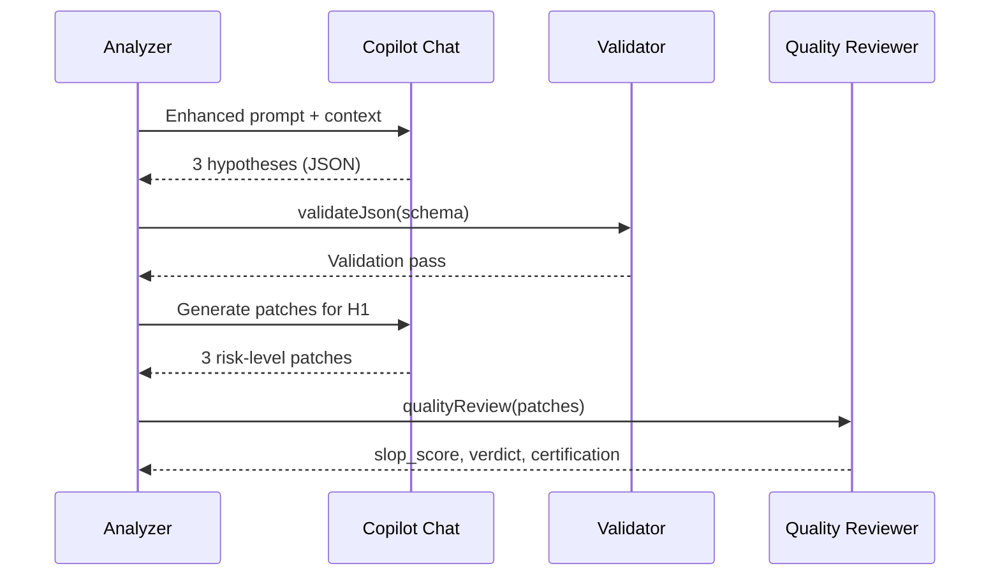

# Copilot Guardian Architecture

## System Overview

Guardian operates as an intelligent CI/CD recovery agent built on three core principles:
1. **Multi-Hypothesis Reasoning** - Never trust a single theory
2. **Sovereign AI** - Complete transparency and user control
3. **Self-Healing Pipelines** - From detection to verification

## High-Level Architecture

```mermaid
graph TB
    subgraph "Detection Layer"
        A[GitHub Actions Webhook] --> B[Guardian CLI]
        B --> C{Failure Detected?}
    end
    
    subgraph "Intelligence Layer"
        C -->|Yes| D[Context Fetcher]
        D --> E[Log Analyzer]
        E --> F[Multi-Hypothesis Engine]
        F --> G[MCP Context Enhancer]
        G --> H[Copilot Chat API]
    end
    
    subgraph "Decision Layer"
        H --> I[Hypothesis Validator]
        I --> J[Patch Generator]
        J --> K[Quality Reviewer]
        K --> L[Anti-Slop Filter]
        L --> M{slop_score < 0.3?}
    end
    
    subgraph "Action Layer"
        M -->|Pass| N[Patch Spectrum Builder]
        N --> O[Conservative Option]
        N --> P[Balanced Option]
        N --> Q[Aggressive Option]
        O & P & Q --> R[User Selection UI]
        R --> S[Auto-Apply Engine]
        S --> T[Git Commit & Push]
        T --> U[CI Retry Trigger]
    end
    
    subgraph "Verification Layer"
        U --> V[Status Monitor]
        V --> W{CI Passed?}
        W -->|Yes| X[Success Report]
        W -->|No| Y[Iteration Engine]
        Y --> F
    end
    
    M -->|Fail| Z[Reject & Alert]
    
    style F fill:#1E293B,stroke:#0DD9FF,stroke-width:3px
    style L fill:#1E293B,stroke:#E293FF,stroke-width:3px
    style S fill:#1E293B,stroke:#00FF88,stroke-width:3px
```



## Data Flow

### Phase 1: Context Gathering


### Phase 2: Analysis & Patch Generation


### Phase 3: Sovereign Decision
```mermaid
graph LR
    A[Patch Options] --> B[Dashboard UI]
    B --> C{User Choice}
    C -->|Conservative| D[Apply Low-Risk]
    C -->|Balanced| E[Apply Medium-Risk]
    C -->|Aggressive| F[Apply High-Impact]
    C -->|Reject| G[Manual Intervention]
    
    D & E & F --> H[applyPatch()]
    H --> I[git add & commit]
    I --> J[git push]
    
    style B fill:#1E293B,stroke:#0DD9FF
    style H fill:#1E293B,stroke:#00FF88
```

## Core Components

### 1. Engine (`src/engine/`)

| Module | Purpose | Key Functions |
|--------|---------|---------------|
| `analyze.ts` | Multi-hypothesis reasoning | `analyzeRun()`, `enhanceContextWithSources()` |
| `patch_options.ts` | Risk-aware patch generation | `generatePatchOptions()`, `qualityReview()` |
| `auto-apply.ts` | File system patching | `applyPatch()`, `verifyPatch()` |
| `github.ts` | GitHub API wrapper | `fetchRunContext()`, `ghAsync()` |
| `mcp.ts` | Model Context Protocol integration | `isMCPConfigured()`, `enhancePrompt()` |
| `async-exec.ts` | Non-blocking CLI execution | `execAsync()`, custom error classes |

### 2. UI (`src/ui/`)

| Module | Purpose |
|--------|---------|
| `dashboard.ts` | High-contrast terminal dashboard |
| `spinner.ts` | Progress indicators during analysis |
| `prompts.ts` | Interactive user choice menus |

### 3. Prompts (`prompts/`)

Engineered prompt templates with:
- Clear task decomposition
- Output format specifications (JSON schemas)
- Anti-hallucination safeguards
- Context injection points

## Key Design Patterns

### 1. Transparency First (Sovereign AI)
Every AI interaction is logged:
```
.copilot-guardian/
├── analysis.raw.txt       # Exact Copilot response
├── analysis.json          # Parsed & validated output
├── patches.raw.txt        # All generated patches
└── decision.log           # User choices + timestamps
```

### 2. Defense in Depth (Anti-Slop)
```typescript
// 3-layer validation
1. Schema Validation (ajv): Ensures structure integrity
2. Quality Review: AI judges AI output
3. Slop Score Calculation: Quantifies "empty calories"
```

### 3. Progressive Enhancement (MCP)
```typescript
// Graceful degradation
if (isMCPConfigured()) {
  context += fetchMCPData(); // Richer context
} else {
  context = basicGitHubData(); // Still functional
}
```

## Security & Privacy

### Secrets Redaction
```typescript
export function redactSecrets(text: string): string {
  return text
    .replace(/ghp_[a-zA-Z0-9]{36}/g, 'ghp_****')
    .replace(/Bearer [a-zA-Z0-9._-]+/g, 'Bearer ****')
    .replace(/password[:\s]+\S+/gi, 'password: ****');
}
```

### Local-First Architecture
- No data sent to third-party servers (except GitHub/Copilot APIs)
- All analysis history stored locally
- User can audit every AI decision

## Performance Characteristics

| Operation | Typical Duration | Bottleneck |
|-----------|------------------|------------|
| Context Fetch | 2-5s | GitHub API rate limits |
| Analysis | 10-20s | Copilot Chat response time |
| Patch Generation | 15-30s | 3 patches × quality review |
| Patch Application | <1s | Disk I/O |
| Total (end-to-end) | 30-60s | AI inference |

### Optimizations
1. **Parallel Patch Generation**: All 3 risk levels generated simultaneously
2. **Streaming Spinners**: User sees progress, not freezing
3. **Async Execution**: Non-blocking `spawn` instead of `execSync`
4. **Smart Context Trimming**: Only relevant source files included

## Extensibility

### Adding New Patch Strategies
```typescript
// src/engine/patch_options.ts
export const STRATEGIES = {
  conservative: { risk: 0.1, scope: 'minimal' },
  balanced: { risk: 0.5, scope: 'targeted' },
  aggressive: { risk: 0.9, scope: 'comprehensive' },
  experimental: { risk: 1.0, scope: 'radical' } // NEW
};
```

### Integrating New MCP Servers
```typescript
// src/engine/mcp.ts
export function detectMCPServers(): string[] {
  const config = readCopilotConfig();
  return [
    ...config.mcpServers['github-mcp-server'] ? ['github'] : [],
    ...config.mcpServers['linear-mcp-server'] ? ['linear'] : [],
    // Add new servers here
  ];
}
```

## Testing Strategy

### Unit Tests (`__tests__/`)
- Mock GitHub CLI responses
- Validate JSON schemas
- Test error handling (timeouts, rate limits)

### Integration Tests
- End-to-end flow with test repository
- Real Copilot API calls (with caching)
- Failure scenario coverage

### Manual QA Checklist
- [ ] Run on fresh repository
- [ ] Test with 3 different failure types
- [ ] Verify all patches apply cleanly
- [ ] Confirm CI retries after patch

## Deployment

### As CLI Tool
```bash
npm install -g @flamehaven/copilot-guardian
guardian fix --repo owner/repo --run 123456
```

### As GitHub Action
```yaml
- uses: flamehaven/copilot-guardian-action@v1
  with:
    auto-fix: true
    risk-level: balanced
```

### As Webhook Service
```typescript
// Express.js endpoint
app.post('/webhook', async (req, res) => {
  if (req.body.action === 'workflow_run' && req.body.workflow_run.conclusion === 'failure') {
    await runGuardian(req.body.repository.full_name, req.body.workflow_run.id);
  }
});
```

---

## Philosophy

Guardian embodies the **Sovereign AI** principle:
> "AI should augment human agency, not replace human judgment."

Every decision point offers:
1. **Transparency**: Full reasoning traces
2. **Choice**: Multiple risk-calibrated options
3. **Control**: User can reject, modify, or delegate

This isn't just automation—it's **liberation**.
